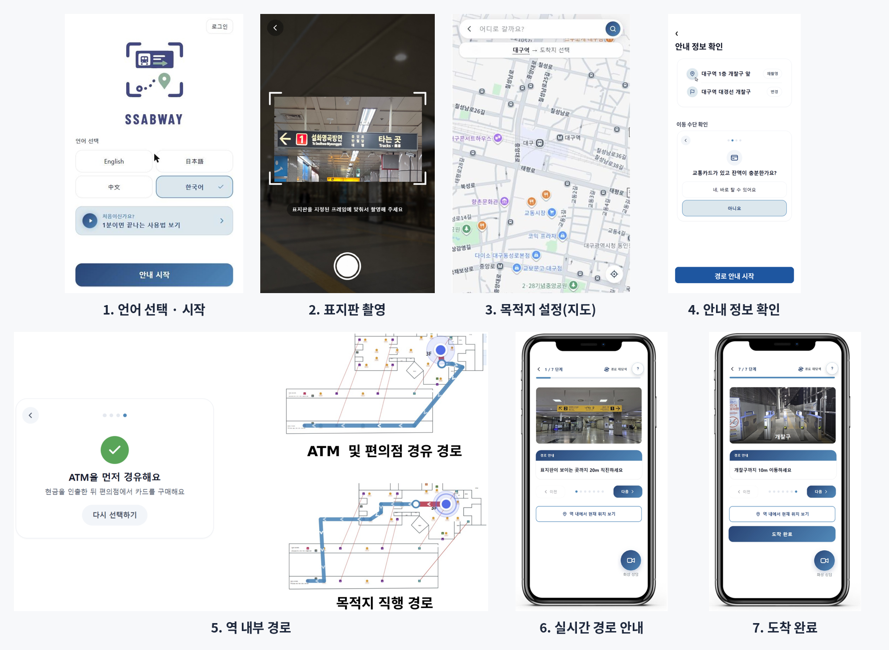
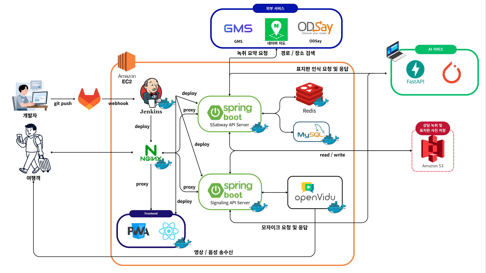
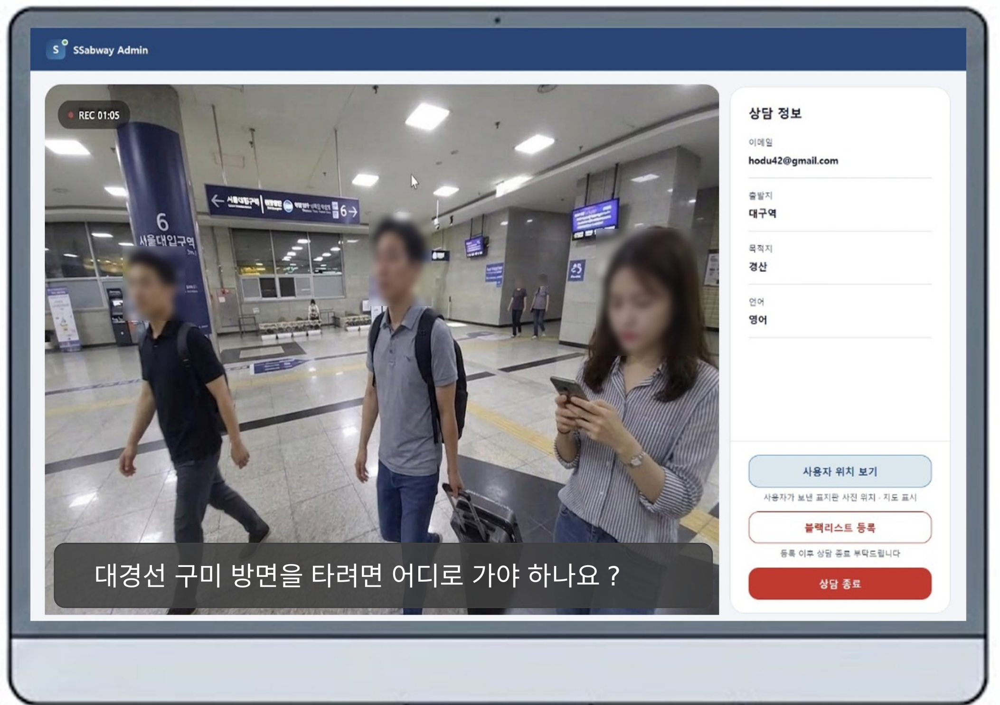
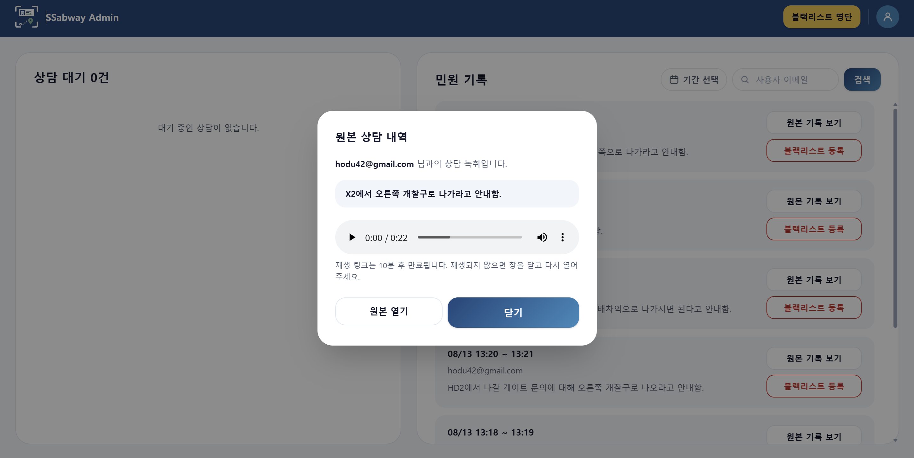

# SSabway

역 안에서 GPS가 끊겨도 길을 잃지 않도록, 안내 표지판을 촬영하면 AI가 위치를 인식해 목적지까지 안내하고, 막히면 역무원과 화상으로 연결하는 실내 길안내 서비스입니다.

<br>

## 한눈에 보기

| | |
|------|------|
| 프로젝트 | SSabway — AI 표지판 인식 기반 지하철 실내 길안내·화상 상담 서비스 |
| 팀 구성 | 6인 (Frontend 2 · Backend 3 · AI 1) |
| 개발 기간 | 2026.07 ~ 2026.08 (약 6주) |
| 담당 | Frontend — 사용자 앱·관리자 앱 화면 및 API 연동 (담당 화면 15+ · 4개국어 i18n) |
| 핵심 지표 | AI 표지판 41종·정확도 92.9% · 역 내부 73개 노드/106개 엣지 그래프 최단경로 · WebRTC 실시간 화상 + 번역 자막 |

<br>

<p align="center">
  
</p>
<p align="center"><sub>사용자 흐름 — 언어 선택 → 표지판 촬영(AI 인식) → 목적지 설정 → 안내 정보 확인(이동 수단) → 역 내부 경로 → 실시간 단계별 안내 → 도착 완료</sub></p>

<br>

## 1. 왜 만들었나

지하철 역사 안에서는 GPS 신호가 잡히지 않아 지도 앱이 무력해집니다. 특히 한국어를 모르는 외국인이나 길찾기가 어려운 이용자에게 환승·출구 찾기는 큰 장벽입니다. SSabway는 이 문제를 표지판 인식, 경로 안내, 화상 상담 세 축으로 풉니다.

| 이용자가 겪는 문제 | SSabway의 해결 |
|------|------|
| 실내에서 GPS가 안 잡힌다 | 역 안내 표지판을 촬영하면 AI(YOLO+ResNet)가 41종 중 위치를 인식 (실전 정확도 92.9%) |
| 어디로 어떻게 가야 할지 모른다 | 역 내부를 73개 노드·106개 엣지 그래프로 모델링, 다익스트라로 역 내 최단 경로와 대중교통 환승 경로를 안내 |
| 그래도 길을 잃었다 | 버튼 하나로 역무원과 실시간 화상 상담(WebRTC) 연결 |
| 한국어를 모른다 | 4개국어(한/영/일/중) 전면 지원 |

<br>

## 2. 기술 스택

**Frontend (담당)**

| 분류 | 기술 |
|------|------|
| Core | React 19 · TypeScript · Vite |
| Style | TailwindCSS v4 |
| 상태 관리 | Zustand · TanStack Query |
| 라우팅 | React Router v7 |
| 실시간 | OpenVidu (WebRTC) |
| 국제화 | i18next · react-i18next |
| 지도 | Google Maps JavaScript API |
| 개발 환경 | MSW(Mock API) · PWA(vite-plugin-pwa) |

**Backend** — Spring Boot 4.1 · Java 21 · Spring Security + OAuth2 · JPA · JWT · MySQL · Redis (+ WebRTC 시그널링 서버)

**AI** — Python · YOLOv8n(표지판 검출) + ResNet18(41종 분류, 92.9%) · 역 내부 그래프(73노드/106엣지) 다익스트라 최단경로

**Infra** — Docker Compose · Jenkins · GitLab CI · Nginx

<br>

## 3. 아키텍처

<p align="center">
  
</p>

GitLab push 시 Jenkins가 EC2·Docker로 자동 빌드/배포하고, SSabway API 서버(Spring Boot)와 Signaling API 서버(OpenVidu)를 Nginx가 프록시합니다. 표지판 인식은 FastAPI(AI) 서버가, 경로·장소 검색은 외부 API(ODsay·지도)가 담당합니다.

프론트엔드는 User App과 Admin App 두 개의 앱으로 나누고, 인증·WebRTC·i18n 등 공통 로직은 `shared` 레이어로 분리했습니다.

```
frontend/src
├── user/     # 사용자 앱  (촬영 → 경로 안내 → 화상 상담)
├── admin/    # 관리자 앱  (상담 응대 · 내역/민원 · 블랙리스트)
├── shared/   # webrtc · api · i18n · station-map · ui  (두 앱 공통)
├── locales/  # ko · en · ja · zh
└── mocks/    # MSW 핸들러  (백엔드 병렬 개발)
```

<br>

## 4. 담당 기능 (Frontend)

| 영역 | 구현 내용 |
|------|------|
| 인증 | 로그인·회원가입·비밀번호 재설정 화면/연동, 구글 소셜 로그인(OAuth2) |
| 지도·경로 | 지도 SDK 네이버 → Google Maps 전환, GPS 현재 위치, 인근 역 탐색, 지도 탭으로 출발·도착지 지정, 역 내/대중교통 경로 안내 |
| 화상 상담 | OpenVidu 세션 훅(`useOpenViduSession`), 사용자·관리자 화상 페이지, 접속 상태·장치 권한 예외 처리 |
| 관리자 대시보드 | 관리자 로그인·메인, 블랙리스트 CRUD(등록/조회/해제/사유수정), 상담 대기열·상담 내역·민원 기록 조회 |
| 공통 | i18n 4개국어 설계 및 전 화면 적용, MSW 목 서버로 백엔드 병렬 개발 |

### 관리자 앱 — 역무원 대시보드

<table>
<tr>
<td width="50%" valign="top"><br><sub><b>화상 상담</b> — 얼굴 자동 모자이크 · 실시간 번역 자막 · 상담 정보 조회 · 블랙리스트 등록</sub></td>
<td width="50%" valign="top"><br><sub><b>상담 대기열 · 민원 기록</b> — 기간·이메일 검색 · 원본 기록 조회 · 블랙리스트 관리</sub></td>
</tr>
</table>

<details>
<summary>전체 화면 설계 (와이어프레임)</summary>

<p align="center">
  
</p>

</details>

<br>

## 5. 트러블슈팅

### 5-1. 화상 상담에서 두 사람의 화면이 서로 다르게 보이던 문제

역무원이 "화면 오른쪽 표지판으로 가세요"라고 안내해도 사용자 화면엔 그 표지판이 안 보였습니다. 사용자·역무원 화면은 같은 발행 프레임을 각자 박스에 `object-cover`로 담는데, 기기마다 화면 비율이 0.46~0.56(약 20% 편차)으로 제각각이라 잘리는 범위가 달랐습니다. 모바일 주소창이 뜨고 사라질 때마다 `100dvh`가 바뀌어 비율을 상수로 고정할 수도 없었습니다.

사용자 브라우저가 자기 박스 비율을 실측해 OpenVidu 시그널로 역무원에게 전송하도록 했습니다. 문제는 입장 순서 경합이었는데, 시그널은 그 순간 접속한 참가자에게만 가므로 사용자·역무원 양방향으로 값을 밀고, 역무원은 리스너를 먼저 붙인 뒤 요청해 응답 유실을 없앴습니다. 값이 못 와도 통화가 유지되도록 기본 비율 폴백을 뒀습니다. 결과적으로 두 화면의 화각 오차가 사라져 "화면 속 위치" 기준 원격 안내가 정확히 동작하고, 값 유실 상황에서도 통화는 끊기지 않습니다.

### 5-2. 상담 중 새로고침 한 번에 상담 정보가 사라지던 문제

역무원이 수락한 상담 정보(이메일·출발지·목적지·언어)를 수락 화면에서 상담 화면으로 라우팅 state로 넘기고 있었는데, 상담 중 새로고침이나 뒤로가기를 하면 정보가 조용히 사라져 화면이 깨졌습니다. 블랙리스트 등록 시 user-info 반환 에러로 처음 드러났습니다.

화면 간 데이터 전달을 라우팅 state에서 Zustand `persist`(sessionStorage) 스토어로 옮겼습니다. 상담 종료 시 `clearDetail()`로 명시적으로 비워 다음 상담 정보와 섞이지 않도록 생명주기를 관리했습니다. 이후 새로고침·뒤로가기에서 상담 정보가 유실되지 않았고, 이 패턴을 세션·상담 정보 전반에 팀 방침으로 통일했습니다.

### 5-3. 카메라 권한을 거부하면 막다른 페이지에 갇히던 문제

카메라 권한을 거부하면 별도의 "권한 없음" 페이지로 이동해 사용자가 되돌아올 길이 없었습니다.

막다른 페이지를 없애고, 실패 원인을 권한 거부와 그 외 오류로 분기했습니다. 권한 거부는 촬영 화면을 유지한 채 4개국어 토스트로 안내해 즉시 재시도할 수 있게 하고, 그 외 오류만 오류 화면으로 보냈습니다. 재사용 가능한 `Toast` 컴포넌트도 이때 확장했습니다. 가장 흔한 실패인 권한 거부에서 이탈 경로가 사라지고 촬영 흐름이 유지됩니다.

### 5-4. 재촬영해도 이전 사진이 뜨던 이미지 캐시 문제

표지판을 다시 촬영해 업로드해도 화면엔 이전 이미지가 그대로 떴습니다. 브라우저가 같은 이미지 URL을 캐시하고 있었기 때문입니다.

이미지 URL에 버전 쿼리스트링을 붙여 캐시를 무효화(cache-busting)해, 매 촬영마다 최신 이미지를 강제로 다시 받도록 했습니다.

### 5-5. 국내 접속 시 첫 화면이 한국어로 뜨던 i18n 기본 언어 문제

주 타깃이 외국인이라 선택 전 기본값은 영어여야 하는데, `LanguageDetector`가 브라우저 언어(navigator)를 감지해 국내 접속이면 `ko`가 기본값을 덮어썼습니다.

감지 소스를 `localStorage`만 보도록 제한하고 `lng` 명시를 제거해, 저장값이 없을 때 `fallbackLng`(영어)로 떨어지게 했습니다. `nonExplicitSupportedLngs`로 `en-US`·`zh-TW`도 각각 `en`·`zh`에 매칭시켜, 기기·지역과 무관하게 기본값이 영어로 잡히도록 했습니다.

### 5-6. 팀원 간 이해가 달라 개발이 어긋나던 문제

팀 전원이 협업이 처음이었습니다. 초기에 와이어프레임을 다 같이 제대로 검토하지 않은 채 작업을 시작했고, 기능을 어떻게 동작시킬지에 대한 이해와 소통이 부족했습니다. 여기에 API 명세서가 제대로 작성되지 않아 요청/응답 형식이 서로 달라, 프론트-백엔드 연동 단계에서 어긋남과 재작업이 반복됐습니다. Frontend 담당으로 화면·API 접점이 가장 많아 이 문제가 제게 직접 드러났습니다.

구현에 들어가기 전에 와이어프레임을 함께 다시 짚어 팀이 같은 화면을 보게 하고, 각자 이해한 동작·데이터 흐름이 실제로 일치하는지를 말로 되짚어 확인하는 과정을 도입했습니다. 특히 API 계약(엔드포인트·요청/응답 필드·상태 전환)을 화면 기준으로 먼저 맞춰, 명세 공백에서 오는 인식 차이를 개발 전에 제거했습니다. 연동 단계의 재작업과 머지 충돌이 줄었고, "무엇을 만들지"만큼 "같은 것을 이해하고 있는지"를 먼저 맞추는 습관이 팀에 자리잡았습니다.

<br>

## 6. 협업 방식

- Git Flow + 이슈 기반 브랜치 — `feat|fix/S15P11D104-{이슈번호}-{작업}` 컨벤션, GitLab MR 코드 리뷰
- 커밋 컨벤션 — Gitmoji + type(feat/fix/refactor…) 규칙 문서화(`CONVENTION.md`)
- CI/CD — GitLab CI · Jenkins · Docker Compose 자동 빌드/배포
- MSW 목 서버로 백엔드 API 완성 전에도 화면 개발을 병렬로 진행 후 무중단 교체

<br>

## 7. 회고

이 프로젝트는 저의 첫 팀 프로젝트였고, 개발 실력만큼이나 프로젝트를 어떤 방향으로 끌고 갈지, 협업 관계를 어떻게 만들지를 크게 배운 시간이었습니다.

팀 전원이 협업이 처음이다 보니 초반엔 진행 방향과 기능 이해가 자주 엇갈렸습니다. 와이어프레임을 함께 충분히 검토하지 않은 채 각자 이해한 대로 만들다 개발 단계에서 화면·API가 어긋나는 일이 반복됐습니다. 그래서 와이어프레임과 기능 정의를 먼저 정리해 팀이 같은 그림을 보게 하고, 구현 전에 서로 이해한 바가 실제로 일치하는지 확인하는 과정을 주도하며 방향을 맞춰 나갔습니다. 협업에서는 무엇을 만들지만큼 같은 것을 이해하고 있는지를 맞추는 소통이 결정적이라는 걸 배웠습니다.

기술적으로는 통제할 수 없는 제약을 UI·상태 설계로 흡수하는 법을 익혔습니다. 실내 GPS 음영, 기기마다 다른 화면 비율, 지역에 따라 달라지는 브라우저 언어처럼 손댈 수 없는 변수를 상수로 박는 대신 런타임에 측정·전달·폴백하는 구조로 풀었습니다. 화면 간 데이터를 sessionStorage 스토어로 통일하며 새로고침·뒤로가기까지 견디는 상태 관리의 중요성을, 두 앱을 `shared`로 묶으며 재사용 경계를 설계하는 감각을 얻었습니다.
